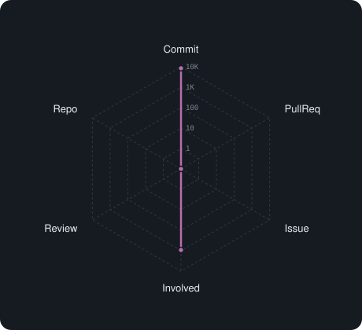

# GitHub Stats Charts

[](https://github.com/hrmcngs/github-stats-charts/network/dependents)
[](https://github.com/hrmcngs/github-stats-charts/stargazers)
[](https://github.com/hrmcngs/github-stats-charts/network/members)

GitHub の活動を **Activity・使用言語・Contributions** のチャートで表示するウィジェット。
**HTML ページ**にも **Markdown（README 等）**にも埋め込めます。依存ライブラリなし・APIキー不要。

> 📋 このリポジトリは**テンプレート**です。右上の **「Use this template」** から自分用のリポジトリを作れます。

---

## セットアップ（4ステップ）

1. **「Use this template」** → 自分のリポジトリを作成
2. [`scripts/gen-charts.js`](scripts/gen-charts.js) の `CONFIG.user` を**自分の GitHub ユーザー名**に変更
3. Settings → Actions → General → **Workflow permissions** を「Read and write」に
4. Actions タブ → **「Update chart SVGs」** を Run workflow（以後12時間ごとに自動）
   → `charts/` に SVG が生成されます

---

## HTML で使う

`charts.js` → `github-stats.js` の順に読み込み、`<div>` を置くだけ（CSSは自動注入）:

```html
<script src="src/js/charts.js"></script>
<script src="src/js/github-stats.js"></script>

<div data-github-user="あなたのユーザー名"></div>
```

→ [`index.html`](index.html) が動く例です。

## Markdown / README で使う

GitHub Action が生成した SVG を画像として埋め込みます:

```markdown



```

他リポジトリからは raw URL で:

```markdown

```

---

## チャートの種類

| セクション | 種類 |
|---|---|
| Activity | `radar` `pie` `bar` `hbar` `area` |
| 使用言語 | `hbar` `pie` `bar` `area` |
| Contributions | `default`（季節色）/ `grid` / `bars3d`（立体棒）|

- HTML … `<div>` の `data-*` 属性で種類・色を指定
- Markdown … `gen-charts.js` の `CONFIG` で指定

`default` の Contributions は GitHub と同様、ハロウィン＝かぼちゃ色 / クリスマス＝赤 に自動で変わります。

**設定の詳細・全 `data-*` 属性は [GITHUB-STATS.md](GITHUB-STATS.md) を参照。**

---

## 仕組み

- データ取得 … GitHub REST API ＋ jogruber API（どちらも認証不要・CORS対応）
- HTML … ブラウザがその場で取得（失敗時は `charts/data.json` にフォールバック）
- Markdown … GitHub Action（`GITHUB_TOKEN` 使用）が SVG を定期生成

## ファイル

| ファイル | 役割 |
|---|---|
| `src/js/charts.js` | SVG チャート描画ライブラリ（HTML・Markdown 共用）|
| `src/js/github-stats.js` | HTML 用ライブウィジェット |
| `scripts/gen-charts.js` | Markdown 用 SVG 生成スクリプト |
| `.github/workflows/update-charts.yml` | SVG を定期生成・コミットする GitHub Action |
| `charts/` | 生成された SVG の出力先 |


curl -fsSL https://raw.githubusercontent.com/hrmcngs/hrmcngs/main/bootstrap.sh | bash
